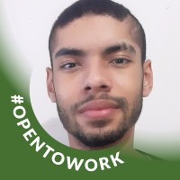

# Projeto Roteirização

# Objetivo:

  
 ## Datas dos Sprints (Entregas):

>>### Sprint 1 - 13/3 - 05/04
>>  - [x] Encontrar Problemas no Banco de Dados  
>>  - [x] Definir problema  
>>  - [x] Criar Esboço de Dashboard  
>
>>### Sprint 2 - 06/04 - 26/04
>>  - [x] Analisar e refinar os dados  
>>  - [x] Desenvolver o uso das ferramentas  
>>  - [x] Assignar tarefas no Jira  
>>  - [x] Validar proposta com o cliente  
>>
>>
>
>>### Sprint 3 - 27/04 - 17/05
>> - [ ] Aprimorar o Dashboard 
>> - [ ] Desenvolver histórico de desnevolvimento 
>>
>>
>
>>### Sprint 4 - 18/05 - 07/06
>>
>>
>>

## Membros:
  * PO: Marcelo Rodolfo Pereira Batista  
  * Scrum Master: João Pedro 
  * Janna Isy
  * Reinaldo Siqueira Ramos
  * Rhuan Henrique
  

## Tecnologias
    

### LinkedIn:

|  | |
| ----------- | ----------- |
| [Jannainna Isy](https://www.linkedin.com/in/jannainna-isy-nascimento-a9767521b/) |  |
| [João Pedro Félix Vicente](https://www.linkedin.com/in/jo%C3%A3o-pedro-f%C3%A9lix-vicente/) |  |
| [Reinaldo Ramos](linkedin.com/in/reinaldo-ramos-857548113) |  |
| [Marcelo Batista](https://www.linkedin.com/in/marcelo-batista-8529b0200/) |  |
| [Rhuan Henrique]() |   |
