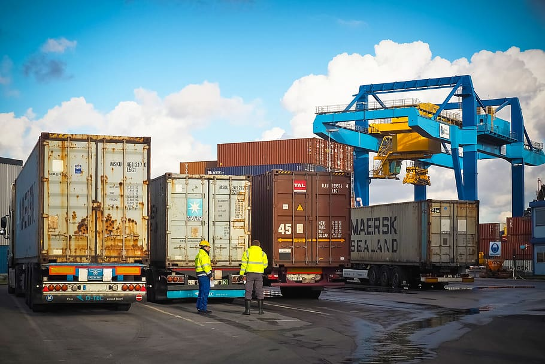

# Projeto Roteirização

# Objetivo:

<h1>
<b>"Desenvolver um Dashboard visual em PowerBI que apresente uma análise detalhada dos dados envolvendo a roteirização apresentados, de forma que atenda a soliticação do cliente e gere um impacto positivo no projeto."</b>

  
 ## Datas dos Sprints (Entregas):

>>### Sprint 1 - 13/3 - 05/04
>>  - [x] Encontrar Problemas no Banco de Dados  
>>  - [x] Definir problema  
>>  - [x] Criar Esboço de Dashboard  
>
>>### Sprint 2 - 06/04 - 26/04
>>  - [x] Analisar e refinar os dados  
>>  - [x] Desenvolver o uso das ferramentas  
>>  - [x] Assignar tarefas no Jira  
>>  - [x] Validar proposta com o cliente  
>>
>>
>
>>### Sprint 3 - 27/04 - 17/05
>> - [ ] Desenvolver relatório de desenvolvimento 
>> - [ ] Calcular as distâncias em haversine
>> - [ ] Encontar o fator de circuito para cada rota
>> - [ ] Aprimorar o dashboard
>> - [ ] Resolver documentação
>> - [ ] Preencher requisitos restantes da análise
>>
>
>>### Sprint 4 - 18/05 - 07/06
>>
>>
>>

## Sprints

### 1ª Sprint
A primeira sprint foi utilizado para analisar e definir os problemas principais, foram analisadas planilhas de fabricas, clientes e rotas, onde foram observadas divergências e apontado ao cliente, após definir e analisar os problemas deu-se início na criação de um esboço para apresentar como dashboard.
| EXCEL | POWER BI (Dashboard) |
|--|--|
|  |  |

### 2ª Sprint

Após a entrega da primeira sprint foi possível observar o que o cliente gostaria de receber nas demais sprints, com isso foi necessário atribuir ferramentas para o trabalho da equipe como o Jira software onde foram atribuídas tarefas para os integrantes e o GitHub para movimentação de dados e arquivos e criar um roteiro de trabalho. Foram analisados e refinados os dados para assim validar as propostas com o cliente.

| GITHUB | JIRA SOFTWARE |
|-|-|
| |  |
### 3ª Sprint

Após a entrega da segunda sprint foram adquiridas ferramentas de trabalho para calcular a distância em haversine, encontrar o fator de circuito de cada uma das rotas, assim trabalhando para aprimorar o painel e os documentos, ouve o preenchimento de alguns requisitos importante da analise e foi gerado o relatório de desenvolvimento do dashboard.

|||
|-|-|
| | |

### 4ª Sprint

#### (A ser decidido)

## Membros: 
  * PO: Janna Isy
  * Scrum Master: João Pedro 
  * Reinaldo Siqueira Ramos
  * Rhuan Henrique
  

## Tecnologias
     
  

### LinkedIn:

|  | |
| ----------- | ----------- |
| [Jannainna Isy](https://www.linkedin.com/in/jannainna-isy-nascimento-a9767521b/) |  |
| [João Pedro Félix Vicente](https://www.linkedin.com/in/jo%C3%A3o-pedro-f%C3%A9lix-vicente/) |  |
| [Reinaldo Ramos](linkedin.com/in/reinaldo-ramos-857548113) |  |
| [Rhuan Henrique](https://br.linkedin.com/in/rhuan-henrique-31752217a?trk=people-guest_people_search-card) |   |
